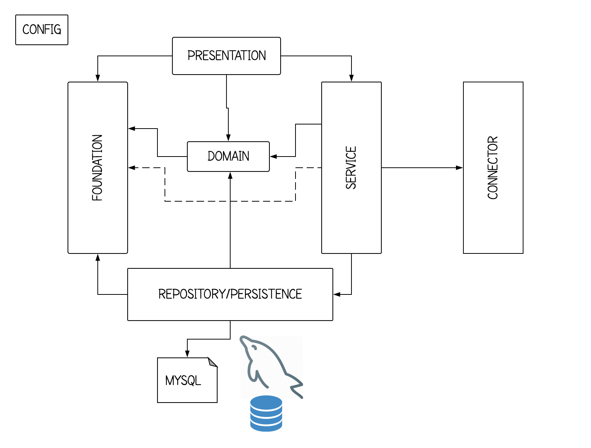
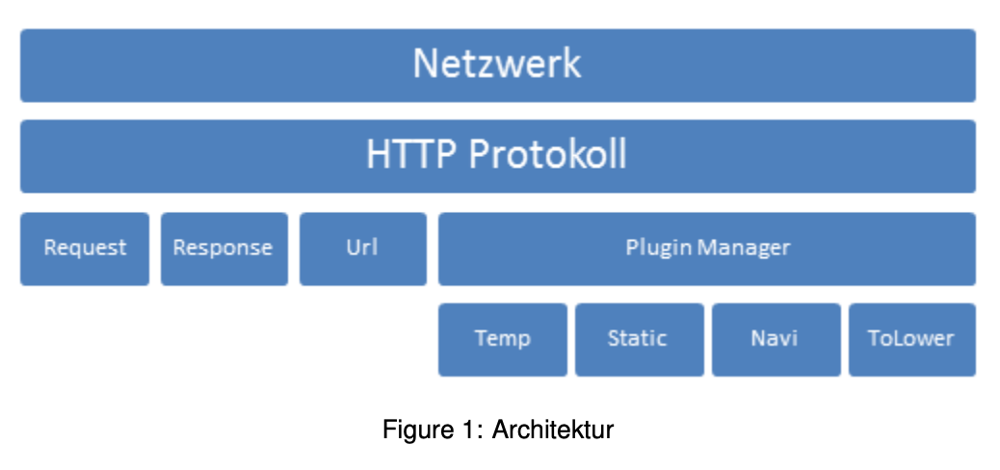

# Measurement data acquisition system

## Requirements

On a Raspberry should be a measurement data
Be implemented detection system. 

The task is to use plug-in metrics
capture and save. 

The mess data can be used by the rest
Sensor cloud can be read. 

The system is configured via a web interface.

These brief details result in the following specific tasks

### Implementation of the web server

- Assumption: On an embedded system resources are limited, therefore no
Windows or LAMP server are running

- Assumption: The system is capable of running a Linux system with Java or the
Execute a mono framework

- For the exercise: The WebServer itself is to implement, only the methods
URLEncode / URLDecode may be used from the BCL.

	* The web server can be reached via port 8080
	* The web server must be multi-user capable
	* The web server must have a plugin system. 

These plugins carry the concrete one
Inquiry.

- Which plugins are used by the web server, must be configurable. 

- Further,
"Third-party plug-ins" must be added without recompiling the web server
can be.

- The measurement data must be stored in a database of your choice.

- To simplify the exercise, the plugins do NOT need to manage the database

## Plugins

### Temperature measurement

* A separate thread constantly reads a sensor
* For the exercise: Random numbers or a sine, etc. are calculated
* These readings are stored in the database of your choice
	- Implement the DAL itself, no OR Mapper is allowed.

* The measured data can be displayed on the web interface
* For the exercise: Generate at least 10,000 measurements spread over the last 10
Years.
* For 10,000 readings, the surface must inevitably support a search or browse
* A REST query http: // localhost: 8080 / GetTemperature / 2012/09/20 should return all temperature data of the specified day as XML. The XML format is freely selectable.

### Static Files

* This plugin should just send files from the file system back to the browser.

* These files should be used to create images, stylesheets, scripts, etc. in HTML.
to be able to integrate
	- It should not explicitly be a "download manager" or "file manager"

### Navi

* As an extra feature, because the embedded system can accommodate memory cards
* A street name is entered in a text box
* The plugin then outputs a list of all places where the street exists.
	- Workers lido street
	- -> In Vienna.
* A map of all streets and places can be obtained from OpenStreetmap.
	- The file would have to be an approx. 4 GB XML document
	- http://download.geofabrik.de/osm/europe/
	- It is enough if one person organizes the file and passes it on to all the others.
* A separate page in the Navi Plugin can trigger the command: "Reprocess the road map"
	- This command reads (re) the OpenStreetmap card and creates an internal street
<-> location assignment in main memory (for example, in a dictionary or hashtable). who
If you want, you can also save it in the database, but it is not mandatory.
	- This can be realized with SAX Parsers
	- It suffice the POI tags! No geographic assignments!
	- XPath: // node | way / tag [@ k, @ v]
	- During this preparation the plugin may not accept any other queries.
It must instead issue a warning message (multi-user capability)

### ToLower

* Any text of any length can be entered in a textarea
* A Submit button sends the text to the server via POST request
* The text is converted to lowercase on the server (.toLower ())
* The result is displayed in a PRE tag below the textarea